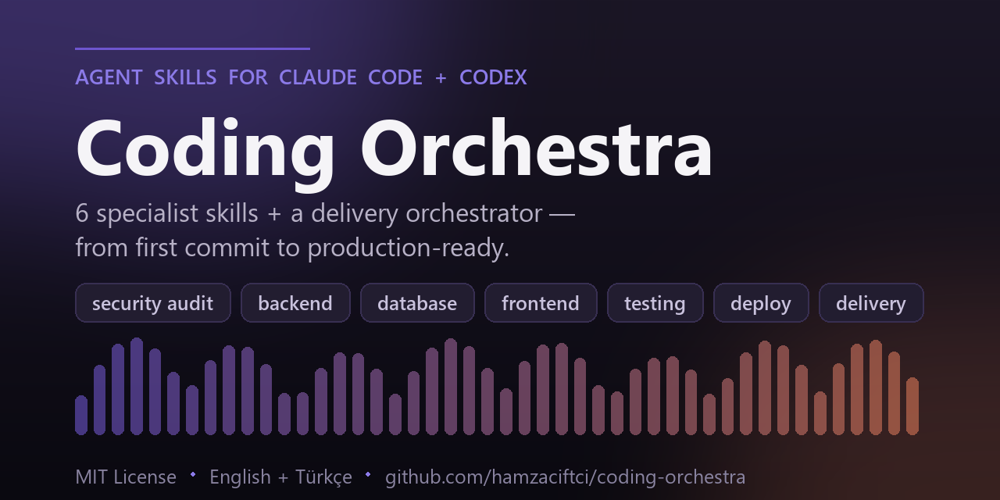

<p align="center">
  
</p>

# 🎻 Coding Orchestra

**Agent Skills for taking web apps to production, for [Claude Code](https://claude.com/claude-code), [Codex](https://developers.openai.com/codex) and any agent that reads the [Agent Skills](https://agentskills.io) format.**

[](https://github.com/hamzaciftci/coding-orchestra/releases)
[](LICENSE)
[](#the-skills)
[](#install)
[](https://agentskills.io)
[](CONTRIBUTING.md)

> [!IMPORTANT]
> **Coding Orchestra has been rebuilt — this is v2.** The eleven long rulebooks of v1 are now seven lean, portable Agent Skills with on-demand references, helper scripts and measured results, and they work in both Claude Code and Codex. [What changed](#what-changed-in-v2) · [Upgrading from v1](#upgrading-from-v1) · [Results](evals/RESULTS.md)

Seven skills that give a coding agent what it does not already have when it works on a Next.js / serverless / PostgreSQL project: the failure modes specific to that stack, the boundaries that matter (what needs your approval, what must never be printed), the shape of a useful deliverable, and small scripts that make an audit start from a complete inventory. One of the seven conducts an end-to-end production-readiness engagement using the others.

> 🇹🇷 Türkçe için → [README.tr.md](README.tr.md)
> The skills ship in **English** (`skills/`) and **Turkish** (`locales/tr/skills/`) with the same structure and scripts.

---

## What changed in v2

v1 was eleven long rulebooks written for models that needed step-by-step management. Current models already know general engineering practice, so most of that text cost context without changing behaviour. v2 keeps the parts that do change behaviour and restructures them:

- **Knowledge the model lacks, not instructions it does not need.** Each `SKILL.md` is under 60 lines: what a good result looks like, where to stop and ask, and judgment calls. Stack-specific detail lives in reference files that load only when the task needs them.
- **Scripts for the deterministic parts.** An entry-point and policy inventory for security audits, an environment-variable inventory that never reads secret values, and a post-deploy smoke check.
- **Portable.** Frontmatter uses only fields from the Agent Skills specification, so the same folders work in Claude Code, Codex and other compatible agents.
- **Fewer, sharper skills.** Eleven became seven. The always-on "general coding" rulebook and the bug-fix rulebook are gone; a 6-line [working agreement](templates/AGENTS.md) for your `AGENTS.md` / `CLAUDE.md` replaces them.
- **Measured.** [`evals/`](evals/) holds a validator, a context-cost comparison against v1, a trigger test and a seeded-flaw audit benchmark. Results, including where v2 did not win, are in [`evals/RESULTS.md`](evals/RESULTS.md).

Coming from v1? See [Upgrading from v1](#upgrading-from-v1).

---

## The skills

| Skill | Use it when | What it adds |
|---|---|---|
| `production-delivery` | You want a whole project audited, finished or made production-ready | Audit across six lenses (in parallel where the agent supports subagents), a prioritized roadmap, approval gate, vertical slices, final go / no-go report |
| `security-audit` | You want vulnerabilities found or closed in an app you own | Inventory script for routes, Server Actions, cron, middleware coverage and row level security; stack pitfalls for Next.js, Supabase, Prisma, Stripe; an 8-field finding format with confidence labels |
| `deployment-readiness` | You are about to deploy, a production build fails, or a deployment needs verifying | Env inventory script (names only), production pitfalls for Vercel / serverless / edge, release checklist with evidence, smoke-check script |
| `backend-engineering` | You add or change an endpoint, Server Action, webhook, cron job, auth or payment flow | A definition of done for server code and the places serverless differs from a long-running server |
| `database-api-design` | You change a schema, write a migration or change an API contract | Staged expand/contract recipes, lock-safe DDL, Prisma and Supabase traps, compatibility rules |
| `frontend-engineering` | You build UI, or an interface needs to look and feel professional | A definition of done for UI, App Router notes, a polish review method |
| `testing-qa` | You add tests, plan QA or verify a fix | Risk-first test plan, authorization matrix, how to test webhooks, cron and Server Actions for real |

Written for **Next.js (App Router) · React · TypeScript · Tailwind · Node serverless · PostgreSQL / Supabase / Prisma · Vercel · Stripe**. The method in each skill carries over to other stacks; the reference detail is specific.

Security work is defensive: the skills are for auditing and fixing systems you own or are authorized to assess, and they tell the agent not to build weaponized exploits or probe third-party hosts.

---

## Install

Pick the route that fits your agent. English is the default; use the Turkish set by swapping the name or flag as shown.

### Claude Code — plugin

```
/plugin marketplace add hamzaciftci/coding-orchestra
/plugin install coding-orchestra@coding-orchestra
```

Turkish: `/plugin install coding-orchestra-tr@coding-orchestra`. Plugin skills are namespaced, for example `/coding-orchestra:security-audit`.

### Claude Code or Codex — installer script

```bash
git clone https://github.com/hamzaciftci/coding-orchestra.git
cd coding-orchestra
./install.sh                    # Claude Code, English  -> ~/.claude/skills
./install.sh --agent codex      # Codex                 -> ~/.agents/skills
./install.sh --agent all --tr   # both, Turkish
```

Windows PowerShell: `./install.ps1`, `./install.ps1 -Agent codex`, `./install.ps1 -Agent all -Tr`.

| Flag (sh / ps1) | Effect |
|---|---|
| `--agent claude\|codex\|all` / `-Agent` | Which agent's skills directory to install into (default `claude`) |
| `--lang en\|tr`, `--en`, `--tr` / `-Lang`, `-En`, `-Tr` | Language (default `en`) |
| `--project` / `-Project` | Install into the current project (`.claude/skills`, `.agents/skills`) so teammates get the skills from the repo |
| `--dir PATH` / `-Dir PATH` | Install into the project at `PATH` |
| `--skill NAME` / `-Skill a,b` | Install only the named skills |
| `--prune-legacy` / `-PruneLegacy` | Remove v1 skills that no longer exist |
| `--force` / `-Force` | Replace a same-named skill that did not come from Coding Orchestra |
| `--dry-run` / `-DryRun` | Show what would happen |

The installer replaces only Coding Orchestra skills. If a different skill with the same name is already installed it is left alone unless you pass `--force`.

### Manual

Copy any skill folder into the directory your agent scans:

```bash
cp -r skills/security-audit ~/.claude/skills/     # Claude Code
cp -r skills/security-audit ~/.agents/skills/     # Codex
```

Each folder is self-contained (`SKILL.md`, `references/`, `scripts/`, `agents/openai.yaml`). The English and Turkish sets use the same skill names, so install one language per location.

Start a new session after installing.

### Optional: the working agreement

Skills load on demand. For the few rules you want in every session (scope, approval points, secret handling, honest reporting), copy the section in [`templates/AGENTS.md`](templates/AGENTS.md) into your project's `AGENTS.md` (Codex and others) or `CLAUDE.md` (Claude Code). Turkish: [`locales/tr/templates/AGENTS.md`](locales/tr/templates/AGENTS.md).

---

## Use

Describe the work and the agent picks the skill from its description:

```
Audit this project end to end and give me a roadmap. Don't change code until I approve the scope.
Check this app for security holes before we launch. Report only.
We deploy on Friday. What blocks the release?
Rename users.fullname to display_name without downtime.
```

Or name a skill explicitly: `/security-audit` in Claude Code (`/coding-orchestra:security-audit` when installed as a plugin), `$security-audit` in Codex.

The helper scripts can also be run directly, with Node 18+ and no dependencies:

```bash
node skills/security-audit/scripts/attack-surface.mjs path/to/project
node skills/deployment-readiness/scripts/env-inventory.mjs path/to/project
node skills/deployment-readiness/scripts/smoke.mjs https://staging.example.com / /login /api/health
```

---

## How a skill is built

```
skills/security-audit/
├── SKILL.md              # ~50 lines: outcome, approach, boundaries, judgment calls
├── references/           # loaded only when the task needs them
│   ├── stack-pitfalls.md
│   └── report-template.md
├── scripts/
│   └── attack-surface.mjs
└── agents/openai.yaml    # display metadata for Codex
```

- The `description` says what the skill does and when to use it; that is all an agent sees until the skill activates.
- `SKILL.md` explains reasons instead of issuing all-caps rules, and leaves the method to the model.
- Frontmatter is limited to `name`, `description`, `license`, `compatibility` and `metadata`. Tool-specific settings stay out so every agent can load the file.
- Skills refer to each other by name. `production-delivery` works alone and goes deeper when the specialists are installed.

---

## Evals

```bash
node evals/validate.mjs        # spec compliance, size budgets, links, EN/TR parity, manifests
node evals/context-cost.mjs    # context footprint, v1 vs current
```

`evals/` also contains a skill-selection test (46 English and Turkish requests, including near-miss negatives) and an audit benchmark: a deliberately flawed Next.js project with 30 seeded issues, audited with no skill, the v1 skill and the current skill. See [`evals/README.md`](evals/README.md) for how to run them and [`evals/RESULTS.md`](evals/RESULTS.md) for the numbers and their limits.

---

## Upgrading from v1

| v1 skill | v2 |
|---|---|
| `production-delivery` | `production-delivery` (rewritten) |
| `fullstack-delivery` | merged into `production-delivery` |
| `security-audit` | `security-audit` |
| `backend-engineering` | `backend-engineering` |
| `database-api-design` | `database-api-design` |
| `deployment-readiness` | `deployment-readiness` |
| `frontend-engineering` | `frontend-engineering` |
| `ui-ux-polish` | merged into `frontend-engineering` (polish review) |
| `testing-qa` | `testing-qa` |
| `general-coding` | retired; see the [working agreement](templates/AGENTS.md) |
| `bug-fix-refactor` | retired; current models do this without a skill |

Other breaking changes: English now lives in `skills/` and is the installer default; Turkish moved to `locales/tr/skills/` (`--tr`). The non-standard `trigger:` frontmatter field is gone. To clean up an existing install, run the installer with `--prune-legacy`.

---

## Repository layout

```
coding-orchestra/
├── skills/                  # English skills (also the Claude Code plugin's skills)
├── locales/tr/              # Turkish skills, plugin manifest and working agreement
├── templates/AGENTS.md      # optional always-on working agreement
├── .claude-plugin/          # plugin and marketplace manifests
├── evals/                   # validator, context cost, trigger test, audit benchmark
├── install.sh, install.ps1
└── README.md, README.tr.md, CONTRIBUTING.md, CHANGELOG.md, LICENSE
```

## Contributing

See [CONTRIBUTING.md](CONTRIBUTING.md). The short version: add knowledge the model does not have, keep `SKILL.md` lean, keep English and Turkish in step, and run `node evals/validate.mjs`.

## License

[MIT](LICENSE) © Hamza Çiftçi.

---

<sub>Not affiliated with Anthropic or OpenAI. "Claude" and "Claude Code" are trademarks of Anthropic; "Codex" is a trademark of OpenAI.</sub>
