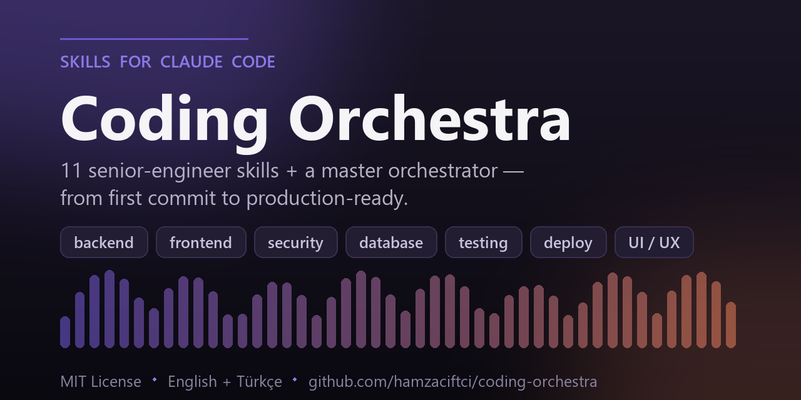

<p align="center">
  
</p>

# 🎻 Coding Orchestra

**[Claude Code](https://claude.com/claude-code) için 11 profesyonel yazılım geliştirme skill'inden oluşan, sahada test edilmiş bir koleksiyon.**

[](https://github.com/hamzaciftci/coding-orchestra/releases)
[](LICENSE)
[](#11-skill)
[](#kurulum)
[](https://claude.com/claude-code)
[](CONTRIBUTING.md)

Claude'u disiplinli bir kıdemli mühendislik ekibine dönüştürür. Her skill belirli bir uzman rolünün (backend mimarı, güvenlik denetçisi, QA mühendisi, ürün tasarımcısı) çalışma prensiplerini kodlar. Ayrıca bir projeyi analizden production'a kadar uçtan uca yürüten bir **ana orkestratör** içerir.

> 🇬🇧 Read in English → [README.md](README.md)
> 📝 Skill'ler hem **Türkçe (`skills/`) hem İngilizce (`skills-en/`)** olarak gelir — kurulumda dilini seçersin.

---

## Neden?

Varsayılan haliyle bir yapay zeka asistanı; projeyi anlamadan kod yazar, yetki kontrollerini atlar, hataları sessizce yutar ve test etmeden "bitti" der. **Coding Orchestra** bunun yerine profesyonel bir disiplin dayatan skill'ler kurar:

- Her değişiklikte **Oku → Analiz et → Planla → Küçük değişiklik → Test et → Raporla**
- Güvenlik, veri bütünlüğü ve edge-case'ler sonradan akla gelen değil, birinci sınıf öncelik
- Dürüst raporlama — "kodda doğruladım" ile "varsayıyorum" ayrımı, asla sahte test sonucu yok
- Minimal, geri alınabilir değişiklikler — istenmeyen rewrite yok

Modern web stack'leri için tasarlandı: **Next.js · React · TypeScript · Tailwind CSS · Node.js · serverless · PostgreSQL / Supabase / Prisma · Vercel.**

---

## 11 Skill

| Slash komutu | Rol | Ne yapar |
|---|---|---|
| `/general-coding` | Senior Engineer / Tech Lead | Her görevin temel mühendislik disiplini |
| `/backend-engineering` | Backend Architect | API, auth, IDOR, validation, transaction, webhook, cron, cache |
| `/frontend-engineering` | Frontend Lead | Component, state, form, loading/empty/error state, a11y, performans |
| `/fullstack-delivery` | Delivery Lead | Denetim, özellik envanteri, teknik borç, roadmap, release checklist |
| `/security-audit` | AppSec Engineer | Açık bul + kapat, her açık için ayrı rapor |
| `/bug-fix-refactor` | Debug/Refactor Uzmanı | Kök sebep çözümü + davranışı bozmayan refactor |
| `/database-api-design` | Data & API Architect | Şema, index, güvenli migration, contract, uyumluluk |
| `/deployment-readiness` | Release Manager | Build geçidi, env/secret, serverless, monitoring, release checklist |
| `/ui-ux-polish` | Product Designer + Design Eng | Amatör → profesyonel SaaS kalitesi |
| `/testing-qa` | QA / SDET | Test piramidi, güvenlik regresyonu, smoke test |
| `/production-delivery` | **Ana Orkestratör** | Tüm skill'leri 11 fazlık uçtan uca akışta çalıştırır |

Her skill aynı yapıyı izler: **Amaç · Rol · Çalışma Prensipleri · İş Akışı · Standartlar · AI nasıl davranmalı · Kritik uyarılar · Güvenli değişiklik sırası · Yapılacaklar/Yapılmayacaklar · Kontrol listesi · Raporlama formatı · Hazır kullanım promptu.**

---

## Kurulum

### Hızlı kurulum (önerilen)

**macOS / Linux:**
```bash
git clone https://github.com/hamzaciftci/coding-orchestra.git
cd coding-orchestra
./install.sh           # Türkçe skill'ler (İngilizce için --en ekle)
```

**Windows (PowerShell):**
```powershell
git clone https://github.com/hamzaciftci/coding-orchestra.git
cd coding-orchestra
./install.ps1          # Türkçe skill'ler (İngilizce için -En ekle)
```

Kurulum scripti her skill'i kişisel Claude Code skill klasörüne (`~/.claude/skills/`) kopyalar; böylece **tüm** projelerinde kullanılabilir olurlar.

**Kurulum bayrakları:**

| Bayrak (sh / ps1) | Etki |
|---|---|
| `--tr` / `-Lang tr` | Türkçe skill seti (`skills/`, varsayılan) |
| `--en` / `-En` | İngilizce skill seti (`skills-en/`) |
| `--project` / `-Project` | `./.claude/skills` içine kurar (sadece bu proje) |
| `--dir PATH` / `-Dir PATH` | Özel bir `.claude/skills` konumuna kurar |

> **Tek** dil seç — İngilizce ve Türkçe setler aynı skill adlarını paylaşır, ikisi birden `~/.claude/skills/` içinde duramaz.

### Manuel kurulum

`skills/` (Türkçe) veya `skills-en/` (İngilizce) altındaki her klasörü `~/.claude/skills/` içine kopyala:

```bash
cp -r skills/* ~/.claude/skills/
```

Tek bir skill kurmak için:
```bash
cp -r skills/security-audit ~/.claude/skills/
```

### Projeye özel kurulum

Skill'leri yalnızca belirli bir projeyle dağıtmak istersen (ekip arkadaşların repo üzerinden alsın diye), global klasör yerine o projenin `.claude/skills/` klasörüne kopyala.

> **Kurulumdan sonra Claude Code'u yeniden başlat** ki skill klasörünü yeniden tarasın. Sonra `/` yazarak görebilir ya da sadece görevini tarif edersen Claude doğru skill'i otomatik seçer.

---

## Kullanım

### Tam uçtan uca teslim
```
/production-delivery
Bu projeyi 11 fazlık akışla uçtan uca production-ready hale getir.
Önce Faz 1-9 denetimlerini yapıp önceliklendirilmiş roadmap sun; onayımdan sonra
dikey dilimlerle uygula, her dilim sonrası ara rapor, sonunda final rapor ver.
```

### Tek bir konuya odaklan
```
/security-audit        → tüm Critical/High açıkları bul ve kapat
/frontend-engineering  → arayüzü profesyonel standarda getir
/deployment-readiness  → projeyi canlıya hazırla
/bug-fix-refactor      → bu hatayı kök sebebiyle çöz ve regresyon testi ekle
/database-api-design   → bu özellik için şema + API contract tasarla
```

### Sadece denetim (kod değişikliği yok)
```
/production-delivery
Sadece Faz 1-9'u uygula. Hiçbir kodu değiştirme — sadece önceliklendirilmiş bulgu + roadmap raporu ver.
```

Slash komutunu yazmak zorunda bile değilsin — işi tarif edersen ("bu projeyi güvenlik açıkları için denetle") Claude ilgili skill'i `description`'ından tetikler.

---

## Nasıl çalışır

Claude Code, skill'leri YAML frontmatter içeren bir `SKILL.md` dosyasına sahip klasörler olarak keşfeder:

```markdown
---
name: security-audit
description: Bu skill ne zaman kullanılır...
trigger: /security-audit
---

# ... tam uzman talimatları ...
```

`description` Claude'a skill'e *ne zaman* başvuracağını, gövde ise devreye girince *nasıl* davranacağını söyler. `/production-delivery` orkestratörü diğer skill'leri fazlara göre çağırır ve çelişki durumunda öncelik sırası uygular: **Güvenlik > Veri bütünlüğü > Doğruluk > Uyumluluk > Performans > Cila.**

---

## Katkı

Katkılar memnuniyetle karşılanır — yeni skill'ler, iyileştirmeler ve özellikle mevcut skill'lerin **İngilizce çevirileri**. Bkz. [CONTRIBUTING.md](CONTRIBUTING.md).

## Lisans

[MIT](LICENSE) © Hamza Çiftçi. Ticari dahil serbestçe kullanabilirsin. Atıf takdir edilir ama zorunlu değildir.

---

<sub>Anthropic ile bağlantılı değildir. "Claude" ve "Claude Code" Anthropic'in ticari markalarıdır.</sub>
